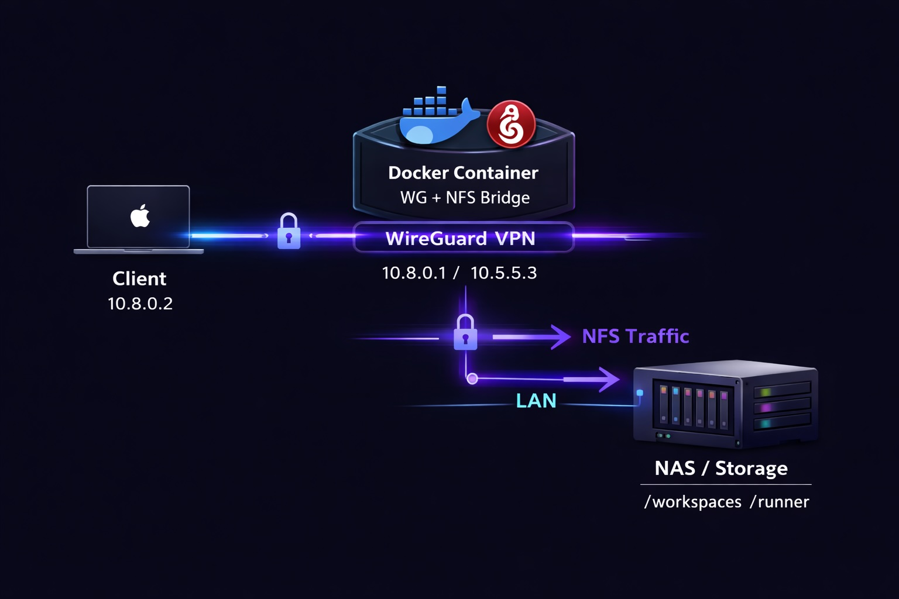
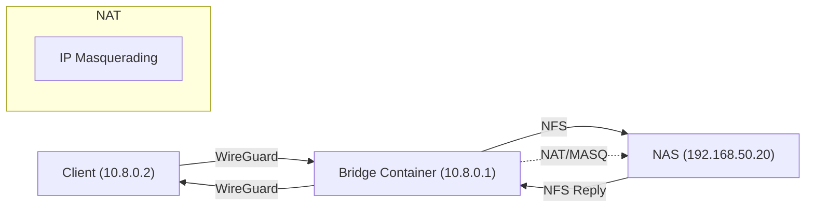
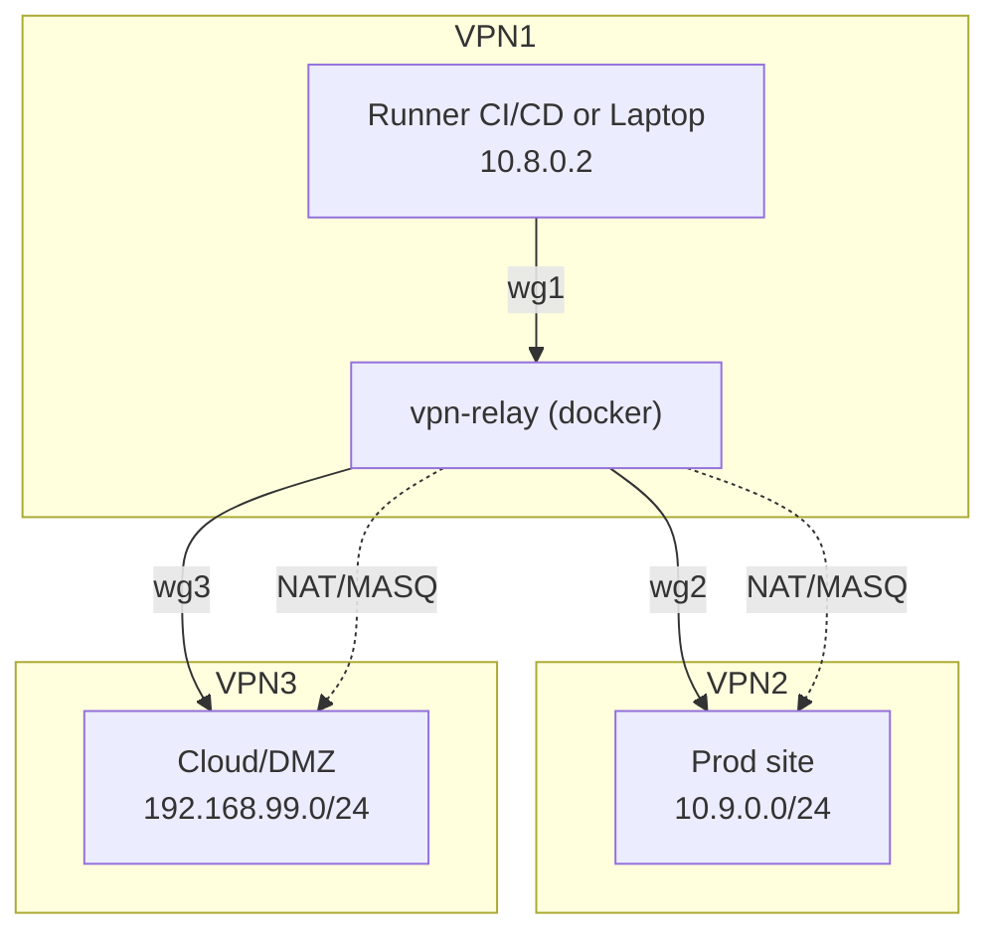
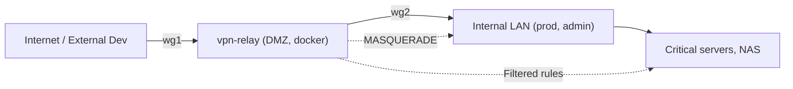
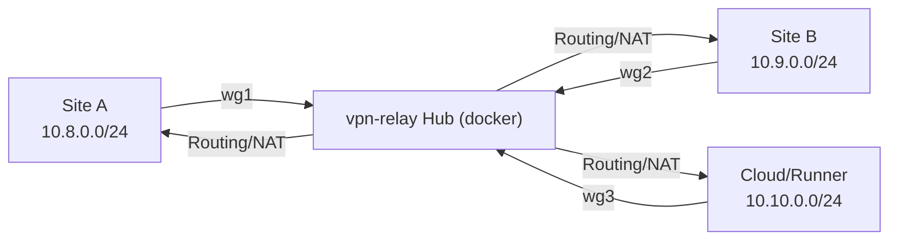
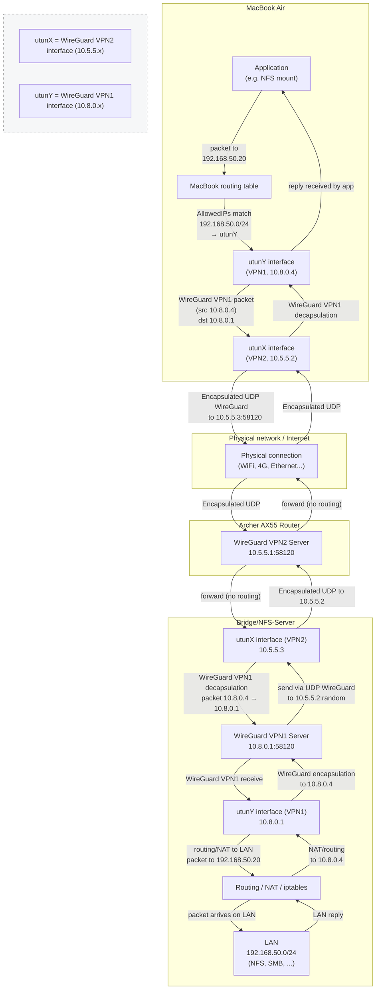

[](https://hub.docker.com/r/dbndev/nfs-wireguard-bridge)

<h1 align="center">🌐 NFS WireGuard Bridge</h1>
<p align="center">
<strong>Securely expose local resources over WireGuard (NFS, Docker, LAN).</strong><br/>
Start with simple NFS access, extend to routing, relay, and advanced network setups.
</p>

<p align="center">
  <!--  -->
  
</p>

---

## 🚀 Pitch

`nfs-wireguard-bridge` is a simple and robust way to expose NFS over WireGuard.

It can also be used for more advanced scenarios such as routing, relay, and multi-network connectivity:

- 🧩 Run an NFS server securely behind a WireGuard tunnel
- 🔒 Access local or NAS volumes remotely without exposing ports
- ⚙️ Act as a router, relay, or gateway when needed
- 🌍 Extendable into multi-node or backbone network topologies

👉 Deploy anywhere (laptop, server, CI runner, cloud VM)  
👉 Instantly extend your private network  

---

## 🎯 Positioning

This project sits between:

- 🟣 **Tailscale / ZeroTier** → mesh VPN
- 🔵 **DevOps tooling** → Docker, CI/CD, buildx, remote environments

But with a key difference:

> 🔥 **Infrastructure-first design: expose compute, storage, and network as composable nodes**

### What it enables

- Distributed Docker build infrastructure (buildx over VPN)
- Remote access to private Docker daemons
- Secure NFS sharing across machines and networks
- Ephemeral CI/CD workers with private network access
- Multi-site / hybrid cloud networking without central gateway

---

## 🧠 Core Concept

Each instance acts as:

- a **VPN peer**
- a **router**
- a **resource gateway**

Once connected:

```
Any node ⇄ Any resource ⇄ Any network
```

👉 Every node can expose capabilities (storage, compute, network) to every other node.

👉 The network itself becomes the infrastructure.

## 🌐 Distributed WireGuard Backbone

No central control plane required (yet).

Each instance of `nfs-wireguard-bridge` can automatically join a shared WireGuard backbone network (e.g. 10.5.5.0/24).

Once connected:

- Local resources (NFS, Docker, LAN) can be exposed to the network
- No central gateway required

This enables a self-organizing private network where nodes can expose and consume capabilities dynamically.

Simply bring interfaces up — routing becomes automatically available.


- **NFS v3 or v4 server** running inside a dedicated container
- **WireGuard VPN** endpoint (server or client mode)
- Securely bridge any local path, NAS share, or Docker volume over VPN
- 🔑 Only trusted peers (with private key) can access NFS export
- 🚀 High-speed, low-latency transfers (native NFS protocol, direct kernel path)
- **No ports exposed** to WAN/Internet
- 🛡️ Docker Compose/Swarm compatible
- Lightweight, stateless, cloud/devbox/lab-ready

---

## Use Cases

- Access your home/office dev folders from anywhere (laptop, cloud VM, etc)
- Bridge a Synology/TrueNAS or any NAS/NFS appliance behind restrictive firewalls
- Replace SMB or slow SSHFS mounts with real, native NFS
- Connect VSCode devcontainers to your remote workstation or NAS
- Use as a building block for advanced self-hosted CI/CD runners
- Temporary secure access to a build or cache folder for remote jobs

---

## Quickstart

### 1. Run the NFS+WireGuard bridge container on the server side

```yaml
# docker-compose.yml
services:
  server:
    image: dbndev/nfs-wireguard-bridge:latest
    container_name: nfs-wireguard-bridge
    cap_add:
      - NET_ADMIN
    privileged: true
    network_mode: bridge
    ports:
      - "51820:51820/udp"
    volumes:
      - /workspaces:/exports/workspaces:rw
      - /runner:/exports/runner:rw
      # Optionally, bridge a NAS/NFS mount from the host
      - video-nas:/exports/video:rw
    environment:
      - WG_CLIENT_PUBKEY=your_client_pubkey
      - WG_CLIENT_IP=10.8.0.2
      - WG_SERVER_PORT=51820
      # ...more options

volumes:
  video-nas:
    driver: local
    driver_opts:
      type: "nfs"
      o: "addr=nas.local,rw,nfsvers=4"
      device: ":/volume1/video"
```

### 2. Configure your WireGuard client (macOS/Linux/Win/Android)

Obtain the config from `state/client.conf` or generate your own. Example:

```ini
[Interface]
PrivateKey = ...
Address = 10.8.0.2/24
DNS = 1.1.1.1

[Peer]
PublicKey = ...
Endpoint = my-home.example.com:51820
AllowedIPs = 0.0.0.0/0
PersistentKeepalive = 25
```

### 3. Mount NFS from the remote client

```sh
# macOS (example, adjust path as needed)
sudo mount -t nfs -o vers=3,rw,resvport 10.8.0.1:/exports/workspaces /private/tmp/testnfs

# Linux
docker run --rm --cap-add SYS_ADMIN --device /dev/fuse nfs-utils mount -t nfs ...
```

---

## Architecture

### Classic NFS Bridging (with remote NAS)



### Embedded NFS Mode (exporting local volumes directly)


---

## Mode Comparison

| Mode                  | Pros                                                       | Cons                                                     |
|-----------------------|------------------------------------------------------------|----------------------------------------------------------|
| **NFS bridge (NAS)**  | - Directly shares remote NAS                              | - Added routing/iptables complexity                      |
|                       | - No NFS server in container needed (just relay)           | - Adds NAT layer, can impact performance                 |
|                       | - Works with legacy/existing NAS configs                  | - NFS export must allow relay server’s LAN IP            |
| **Embedded NFS**      | - Direct NFS from host paths/volumes (no relay)           | - Shares only container’s accessible folders             |
|                       | - No extra NAT, simple routing                           | - Cannot re-export upstream NFS in all cases (root_squash/NAS options may block) |
|                       | - Fastest for code/CI dev                                 | - Requires host volume mounts                            |

#### When to use each mode?
- Use **Embedded NFS** when you want to share your devbox/server’s real files or Docker bind-mounts directly (full control, best perf, ideal for CI/dev).
- Use **Bridge/NAS** mode when your data is on a NAS or an NFS server you *cannot* touch, or want to provide access to NAS data over VPN.

---

## DockerHub Integration

Build & push automated:

```sh
# Manual push
DOCKER_BUILDKIT=1 docker buildx build --platform linux/amd64,linux/arm64 \
  -t dbndev/nfs-wireguard-bridge:latest --push .
```

- See https://hub.docker.com/r/dbndev/nfs-wireguard-bridge
- Add badge: 
- For CI/CD: add GitHub Actions workflows for multiarch builds and auto-push

---

## 🔧 Customization

- The environment variables `NFS_WIREGUARD_BRIDGE_SERVER_HOST` and `NFS_WIREGUARD_BRIDGE_SERVER_PORT` are available in `docker-compose.yml`.  
- To expose other folders: edit the `volumes:` section in `docker-compose.yml` and add the path to `/etc/exports` via `entrypoint.sh`.  

---

## 📝 Dependencies

- Docker Engine (recommended: version 20+)  
- Client: WireGuard, NFS utility (`nfs-common` on Linux, `nfs-client` on macOS)  

---

## 🏆 WireGuard Benefits

- Instant startup, optimal performance, simple key and route management  
- No “race condition” with port opening (everything is tunneled)  

---

## ❤️ Thanks / Contribution

Feel free to open an issue, submit a PR, or fork!  
This project is used in the Vegito ecosystem, but remains agnostic and open source.

---

## VPN Relay – Multi-site WireGuard Relay for DevOps

**Flexible, multi-tunnel VPN relay designed for secure, automated interconnection of remote networks, DMZ, LAN, cloud, and hybrid environments.**

---

## Why Dockerize a VPN Relay?

### **Concrete Advantages of WireGuard Containerization for DevOps Teams**

- **Extreme portability**: identical deployment on Linux, VM, cloud, cluster, laptop, CI/CD…
- **Reproducibility**: fixed version of WireGuard, scripts, iptables, NAT… all in the image
- **Automation**: orchestratable (compose, swarm, k8s, systemd), “as code” provisioning, GitOps/CI integration
- **Idempotence & maintenance**: restart with no side effects, stateless, easy rolling-update
- **Security**: reduced attack surface, strict permissions (volumes, networks, users, capabilities…)
- **Audit & rollback**: logs, traces, rollbacks on image version
- **Easy migration**: a Dev or Prod stack can be moved between clouds without breaking things
- **Lightweight isolation**: the container controls the kernel interface but does not pollute the host OS
- **Multi-role**: router, relay, bridge, DMZ, mesh, failover, multi-site NAT

### **Why does the DevOps industry already work this way?**
- **Containerized network infra** (DNS, reverse-proxy, VPN, mesh, loadbalancer, firewall, monitoring…) is **the standard** for all “as code” contexts.
- WireGuard, like OpenVPN, StrongSwan, or FRR, is widely used in container form for portability, automation, CI/CD, cloud and hybrid environments.
- DevOps teams deploy and manage their “network backbone” the same way as their app infra, using Docker/K8s/Nomad/Compose/Terraform, etc.

---

## Typical Use Cases (DevOps & Modern IT)

- **VPN relay between multiple sites, datacenters, or clouds**
- **Chained VPN**: mobile → cloud/fiber entry point → enterprise backbone
- **DMZ gateway** to isolate public prod from internal admin
- **CI/CD automation**: ephemeral tunnels for tests, secure access to private resources
- **Failover and redundancy**: multi-site mesh for SRE, disaster recovery resilience
- **LAN ↔ cloud bridge**: secure access to on-prem internal services from the cloud or a CI runner
- **Multi-tenant network**, isolation of prod/staging/dev by subnet

---

## Quick Start

```yaml
services:
  vpn-relay:
    image: dbndev/vpn-relay:latest
    container_name: vpn-relay
    cap_add:
      - NET_ADMIN
    privileged: true
    network_mode: bridge
    ports:
      - "51820:51820/udp"
      - "51820:51820/udp"
    volumes:
      - ./state:/state
      - ./conf:/conf
    environment:
      - WG1_INTERFACE=wg1
      - WG1_PRIVATE_KEY=...
      - WG1_PORT=51820
      - WG1_PEERS=...
      - WG2_INTERFACE=wg2
      - WG2_PRIVATE_KEY=...
      - WG2_PORT=51820
      - WG2_PEERS=...
```

- All WireGuard config files are stored in `/conf` or `/state`
- The container auto-detects and mounts client interfaces (multi-peer)
- NAT/iptables/routing rules can be customized/automated

---

## Architecture – Usage Diagrams

### 🟦 Multi-VPN Relay (DevOps chaining, cloud access)



### 🟩 DMZ Gateway (admin access isolation)



### 🟨 Mesh/Hub for Multi-site Failover



### 🟫 Double-VPN / Multi-homed Bridge (Advanced Scenario)

#### Scenario: Remote NFS mount via nested VPN to bypass router/NAT limitations or mobile/ISP restrictions using a VPN relay.

##### Step-by-step breakdown
1. MacBook prepares a packet to 192.168.50.20 (LAN)
2. Local routing (via AllowedIPs) sends this packet into interface utunY (VPN1), which encapsulates it in WireGuard (source 10.8.0.4 → 10.8.0.1)
3. The VPN1 tunnel, whose endpoint is actually 10.5.5.3:58120 (the bridge's address on VPN2), carries this packet through the VPN2 tunnel (utunX/10.5.5.2)
4. The physical network (WiFi, 4G, Internet) only sees UDP WireGuard packets to 10.5.5.3:58120
5. Archer AX55 receives traffic on its VPN2 interface, simply forwards to 10.5.5.3 (bridge)—it does not route
6. Bridge receives the UDP flow on 10.5.5.3:58120, decapsulates VPN1, processes the traffic on 10.8.0.1 (multi-homed)
7. Bridge routes or NATs the traffic to LAN 192.168.50.x via its local rules (iptables or direct routing)
8. The reply follows the reverse path, encapsulated in VPN1 then VPN2 back to the MacBook



---

## DevOps Best Practices

- **Everything as code/infra as code** (compose, Makefile, Terraform…)
- **Automate keys, peers, NAT, routes** (init scripts, hooks, pipelines)
- **Audit/Logging** via stdout, Docker logs, monitoring sidecar
- **Security**: regular key rotation, strict AllowedIPs, admin exposure control
- **Idempotence**: redeploy safely, rolling-update support, clean teardown
- **Observability**: connectivity tests, traces, state hooks, customizable healthchecks

---

## Supported Environment Variables

- `WG1_INTERFACE`, `WG2_INTERFACE`, …
- `WG1_PRIVATE_KEY`, `WG2_PRIVATE_KEY`, …
- `WG1_PORT`, `WG2_PORT`, …
- `WG1_PEERS`, `WG2_PEERS`, …
- `NAT_RULES` (optional)
- `ROUTE_RULES` (optional)

---

## 📣 Author

David Berichon ([dbndev](https://github.com/dbndev))

---

## 📦 Docker Hub

Contact me if you want a ready-to-use public image!

---

## 🔗 License

MIT